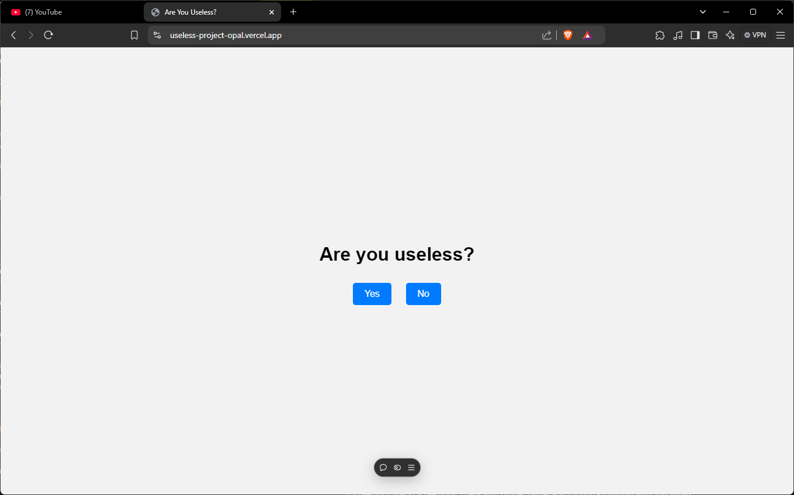

# Useless me 🎯

## Basic Details
### Team Name: Akhil B Xavier's Team

### Team Members
- Team Lead: Akhil B Xavier - AISAT

### Project Description
A useless project that does nothing useful. its a game of uselessness

### The Problem (that doesn't exist)
A wabsite with a story game

### The Solution (that nobody asked for)
[How are you solving it? Keep it fun!]

## Technical Details
### Technologies/Components Used
- HTML CSS JS
- Vercel

### Implementation
For Software:
# Installation
Open the index.html file in your browser.

# Run
[commands]

### Project Documentation
For Software:

# Screenshots (Add at least 3)

### Project Demo
# Video
https://useless-project-opal.vercel.app/
*Explain what the video demonstrates*

---
Made with ❤️ at TinkerHub Useless Projects

